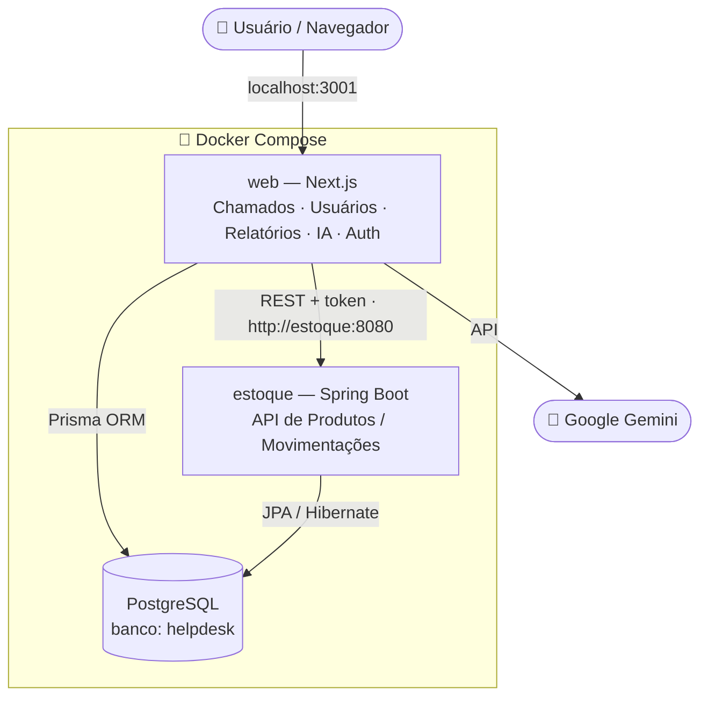

# 🎫 Helpdesk

Sistema interno de **abertura e gestão de chamados de TI** com **controle de estoque** e um **assistente de IA**. Funcionários abrem chamados, a equipe de TI gerencia a fila, e um painel de relatórios ajuda a enxergar onde estão os gargalos.

O projeto integra **dois serviços independentes** — um front/back em **Next.js** e um microsserviço em **Java/Spring Boot** — sobre um banco **PostgreSQL**, tudo orquestrado por **Docker Compose**. A autenticação usa senhas com hash (bcrypt) e sessões assinadas (iron-session), e a API do estoque é protegida por token.

---

## 📑 Índice

- [Visão geral](#-visão-geral)
- [Arquitetura](#-arquitetura)
- [Stack tecnológica](#-stack-tecnológica)
- [Segurança](#-segurança)
- [Funcionalidades](#-funcionalidades)
- [Modelos de dados](#-modelos-de-dados)
- [API do serviço de estoque (Java)](#-api-do-serviço-de-estoque-java)
- [Pré-requisitos](#-pré-requisitos)
- [Variáveis de ambiente e geração de chaves](#-variáveis-de-ambiente-e-geração-de-chaves)
- [Como rodar o projeto](#-como-rodar-o-projeto)
- [Credenciais de acesso](#-credenciais-de-acesso)
- [Solução de problemas (Troubleshooting)](#-solução-de-problemas-troubleshooting)
- [Melhorias futuras](#-melhorias-futuras)

---

## 🔎 Visão geral

O Helpdesk centraliza os pedidos de suporte de TI de uma empresa com várias unidades. O funcionário abre um chamado, escolhe a loja e a urgência, e acompanha o andamento pela plataforma. A TI gerencia a fila, registra soluções e acompanha relatórios.

Três perfis de usuário:

| Perfil | Acesso |
|--------|--------|
| **USER** (comum) | Abre chamados e acompanha os próprios chamados |
| **TECH** (técnico) | Tudo do USER + gerencia a fila de chamados e usa o Assistente IA |
| **ADMIN** (TI) | Tudo do TECH + relatórios, controle de estoque e gestão de usuários |

---

## 🏗 Arquitetura

Três containers orquestrados pelo Docker Compose, na mesma rede interna:



- **web** — coração do sistema: login, chamados, usuários, relatórios, assistente de IA. Usa Next.js (App Router + Server Actions) e Prisma.
- **estoque** — microsserviço Java/Spring Boot com API REST de produtos e movimentações, protegida por token. A tela de estoque do `web` consome essa API.
- **PostgreSQL** — banco compartilhado (`helpdesk`): tabelas do Prisma (`User`, `Ticket`...) convivem com as do estoque (`produtos`, `categorias`, `movimentacoes`).

> Dentro do Docker, os serviços se enxergam pelo **nome** (`db`, `estoque`), não por `localhost`. Por isso a URL interna do banco é `db:5432` e a da API é `http://estoque:8080`.

---

## 🛠 Stack tecnológica

### Front-end / Back-end principal (`web`)
- **Next.js** (App Router, Server Actions) — versão 16.x
- **TypeScript** + **Tailwind CSS**
- **Prisma ORM** (v5.22)
- **bcryptjs** — hash de senhas
- **iron-session** — sessão assinada/criptografada
- **@google/generative-ai** — modelo Gemini para o Assistente IA

### Microsserviço de estoque (`estoque`)
- **Java 17** + **Spring Boot** (Web + Data JPA)
- **Hibernate**, **Lombok**, **Maven** (wrapper `mvnw`)
- Filtro de segurança próprio (CORS + validação de token)

### Infraestrutura
- **PostgreSQL 15** (`postgres:15-alpine`)
- **Docker** + **Docker Compose**

---

## 🔒 Segurança

A autenticação e a API foram construídas seguindo boas práticas:

| Mecanismo | Como funciona |
|-----------|---------------|
| **Hash de senha (bcrypt)** | Senhas nunca são guardadas em texto puro. No cadastro são hasheadas com bcrypt; no login, compara-se o hash. Um vazamento do banco não expõe as senhas. |
| **Sessão assinada (iron-session)** | O cookie de sessão é criptografado e assinado com um segredo do servidor (`SESSION_SECRET`). Um cookie adulterado é rejeitado — não dá para forjar identidade. |
| **"Lembrar de mim"** | Marcado → cookie dura 7 dias (persiste ao fechar o navegador). Desmarcado → cookie de sessão, apagado ao fechar o navegador. |
| **Redirect de login** | Quem já está logado é redirecionado da tela de login para a home. |
| **Cookie `secure` em produção** | Em produção, o cookie só trafega por HTTPS. |
| **Proteção de papel (RBAC)** | Rotas administrativas checam `role === 'ADMIN'`; usuários comuns são redirecionados. |
| **API Java protegida** | Todo request ao serviço de estoque exige o header `X-API-Token` válido; sem ele, retorna `401`. O CORS é restrito à origem do front. |

> **Nota sobre o token da API:** por ser consumido pelo front no navegador, o token vai numa variável `NEXT_PUBLIC_`, portanto visível no cliente. Isso bloqueia acesso externo/casual à API, mas não é blindagem contra um usuário que inspecione o próprio navegador. Para blindagem total, o passo seguinte seria um proxy server-side (ver [Melhorias futuras](#-melhorias-futuras)).

---

## ✨ Funcionalidades

### Para todos os usuários
- Login por usuário e senha, com opção **"Manter conectado"**
- Abertura de chamados (título, loja, urgência, descrição) com previsão de SLA
- **Meus Chamados** — acompanhamento do status (Aberto → Em Análise → Resolvido)

### Para a equipe técnica (TECH / ADMIN)
- **Gerenciar Fila** — todos os chamados, com filtro por status e prioridade
- Fluxo de atendimento — marcar "Em Análise", agendar, registrar solução, finalizar, reabrir
- **Assistente IA** — chat em linguagem natural sobre a fila (via Gemini)
- **Notificações** — polling com aviso sonoro e do navegador

### Para administradores (ADMIN)
- **Relatórios de TI** — volume de chamados, fila pendente, ranking de técnicos, lojas e setores mais problemáticos
- **Controle de Estoque** — produtos, uso/reposição, histórico e alerta de estoque crítico (via API Java)
- **Gestão de Usuários** — cadastro, edição e exclusão

---

## 🗃 Modelos de dados

### Banco principal (Prisma — `web`)

**Enums:** `Role` (USER, TECH, ADMIN) · `TicketStatus` (OPEN, IN_PROGRESS, CLOSED) · `Priority` (LOW, MEDIUM, HIGH, CRITICAL)

| Modelo | Descrição |
|--------|-----------|
| `Store` | Loja/unidade |
| `User` | Usuário (username único, nome, senha **hasheada**, papel, setor, loja) |
| `Category` | Categoria do chamado |
| `Asset` | Ativo/equipamento |
| `Ticket` | Chamado (título, descrição, prioridade, status, solução, datas, autor, responsável, loja, categoria) |
| `Comment` | Comentário em chamado |

### Banco do estoque (JPA — `estoque`)

| Entidade | Tabela | Campos |
|----------|--------|--------|
| `Categoria` | `categorias` | nome |
| `Produto` | `produtos` | nome, quantidade, estoqueMinimo, categoria |
| `Movimentacao` | `movimentacoes` | tipo (ENTRADA/SAIDA), quantidade, dataHora, observacao, produto |

---

## 🔌 API do serviço de estoque (Java)

Base URL (local): `http://localhost:8080` · **Todas as rotas exigem o header `X-API-Token`.**

| Método | Rota | Descrição |
|--------|------|-----------|
| `GET` | `/produtos` | Lista produtos |
| `POST` | `/produtos` | Cria produto |
| `PUT` | `/produtos/{id}` | Atualiza nome e estoque mínimo |
| `DELETE` | `/produtos/{id}` | Exclui produto (e histórico) |
| `PATCH` | `/produtos/{id}/consumir?quantidade=&observacao=` | Registra saída |
| `PATCH` | `/produtos/{id}/repor?quantidade=` | Registra entrada |
| `GET` | `/produtos/{id}/historico` | Movimentações do produto |
| `GET` / `POST` | `/categorias` | Lista / cria categorias |

---

## 📦 Pré-requisitos

- **[Docker Desktop](https://www.docker.com/products/docker-desktop/)** instalado e rodando
- No Windows: **WSL 2** (o Docker Desktop configura na instalação) e **virtualização habilitada** na BIOS
- **OpenSSL** (para gerar as chaves — já vem no WSL/Linux/Mac; no Windows, use o Git Bash)
- ~8 GB de RAM recomendados

---

## 🔑 Variáveis de ambiente e geração de chaves

Todas as credenciais ficam em um arquivo **`.env` na raiz do projeto** (mesma pasta do `docker-compose.yml`). Esse arquivo **não** vai para o Git.

### Conteúdo do `.env` (raiz)

```env
# Banco de dados
DB_USER=admin
DB_PASSWORD=troque_esta_senha

# Google Gemini (Assistente IA)
GEMINI_API_KEY=sua-chave-do-gemini

# Segredo da sessão (iron-session) — mínimo 32 caracteres
SESSION_SECRET=seu-secret-gerado

# Token da API do estoque — MESMO valor nas duas linhas
API_ESTOQUE_TOKEN=seu-token-gerado
NEXT_PUBLIC_API_ESTOQUE_TOKEN=seu-token-gerado
```

### Como gerar cada chave

**1. `SESSION_SECRET`** — segredo que assina os cookies de sessão (mín. 32 caracteres):
```bash
openssl rand -base64 32
```

**2. `API_ESTOQUE_TOKEN`** — token de acesso à API Java. Use **hexadecimal** para evitar caracteres (`/`, `+`, `=`) que quebram em headers HTTP:
```bash
openssl rand -hex 24
```
Cole o **mesmo valor** em `API_ESTOQUE_TOKEN` e `NEXT_PUBLIC_API_ESTOQUE_TOKEN`.

**3. `GEMINI_API_KEY`** — gere gratuitamente no [Google AI Studio](https://aistudio.google.com/apikey).

### Onde cada variável é usada

- **`db`** → `POSTGRES_USER` / `POSTGRES_PASSWORD`
- **`web`** → `DATABASE_URL`, `GEMINI_API_KEY`, `SESSION_SECRET`, `API_ESTOQUE_TOKEN`, `NEXT_PUBLIC_API_ESTOQUE_TOKEN`
- **`estoque`** → `SPRING_DATASOURCE_*`, `API_ESTOQUE_TOKEN`

> ⚠️ **`NEXT_PUBLIC_API_ESTOQUE_TOKEN` é uma variável de *build*.** No `docker-compose.yml`, ela é passada ao serviço `web` também como **build arg** (dentro de `build.args`), porque o Next.js "assa" variáveis `NEXT_PUBLIC_` no bundle durante o `npm run build` — passá-la só em `environment` (runtime) não funciona. O `Dockerfile` do web recebe esse arg via `ARG` + `ENV` antes do `npm run build`.

> 🔒 Confirme que o `.env` está no `.gitignore`: `git check-ignore .env` deve retornar `.env`. Um `.env.example` (sem valores reais) é versionado como referência.

---

## 🚀 Como rodar o projeto

### 1. Clone o repositório
```bash
git clone <url-do-seu-repositorio>
cd helpdesk
```

### 2. Crie o `.env` na raiz
Use o modelo da seção anterior e gere as chaves com os comandos indicados.

### 3. Suba os containers
```bash
docker compose up -d --build
```

| Container | Porta (host:container) | O quê |
|-----------|------------------------|-------|
| `helpdesk_web` | `3001:3000` | Aplicação Next.js |
| `estoque_api` | `8080:8080` | API Java |
| `helpdesk_db` | `5433:5432` | PostgreSQL |

### ⚠️ 4. Crie as tabelas e popule o banco (ESSENCIAL)

Subir os containers cria o banco **vazio**. Sem este passo, o login retorna **erro 500** (`The table 'public.User' does not exist`). Rode:

```bash
docker compose exec web npx prisma migrate reset --force
```

Isso aplica as migrations, cria as tabelas e roda o `seed.ts` (categorias, lojas e usuários de teste, com senhas já hasheadas). Aguarde `Database reset successful` e `Banco populado com sucesso!`.

> 💡 Os dados ficam num **volume** (`postgres_data`) que sobrevive a reinícios. Só é preciso repetir este passo na primeira vez ou após `docker compose down -v` (que apaga o volume). Use `docker compose down` **sem** `-v` para preservar os dados.

### 5. Acesse
Abra **[http://localhost:3001](http://localhost:3001)** e faça login.

---

## 🔑 Credenciais de acesso

O sistema tem **dois tipos de credencial** — não confunda:

### 1. Login do sistema (o que você digita na tela)
Usuários de teste do `seed.ts`. Senha padrão de todos: **`123`**.

| Usuário | Perfil | Uso |
|---------|--------|-----|
| `carlos.ti` | ADMIN | acesso total (fila, relatórios, estoque, usuários) |
| `maria.caixa` | USER | usuário comum |
| `joao.acougue` | USER | usuário comum (outra loja) |

### 2. Credenciais do banco (uso interno)
Definidas no `.env` (`DB_USER` / `DB_PASSWORD`). Você não as digita em lugar nenhum; a aplicação as usa para conectar ao PostgreSQL. Para inspecionar o banco por fora (ex.: DBeaver), conecte em `localhost:5433`.

---

## 🔧 Solução de problemas (Troubleshooting)

**Erro 500 no login / `table 'public.User' does not exist`**
Banco vazio. Rode o passo 4:
```bash
docker compose exec web npx prisma migrate reset --force
```

**`iron-session: Bad usage. Missing password`**
Falta o `SESSION_SECRET` no container `web`. Confirme a variável no `.env` (raiz) e a linha `SESSION_SECRET: ${SESSION_SECRET}` no serviço `web` do `docker-compose.yml`. Depois `docker compose up -d`.

**Estoque retorna 401 / header `X-API-Token: undefined`**
A variável `NEXT_PUBLIC_API_ESTOQUE_TOKEN` não entrou no build. Garanta que ela é passada como **build arg** ao serviço `web` (bloco `build.args`) e que o `Dockerfile` do web tem `ARG`/`ENV` antes do `npm run build`. Rebuild obrigatório:
```bash
docker compose up -d --build
```

**Erro de CORS no console do navegador**
O filtro do estoque (`ApiTokenFilter`) trata CORS e token juntos, na ordem certa. Garanta que os controllers **não** têm mais `@CrossOrigin` (o CORS é global no filtro). Após ajustar, `docker compose up -d --build` e recarregue com **Ctrl+Shift+R** (o Chrome cacheia respostas de CORS).

**Porta 8080 em uso (`bind: address already in use`)**
Outro programa ocupa a porta. Descubra quem:
```bash
netstat -ano | findstr :8080
```
Feche/desinstale o dono do PID, ou mude a porta externa do serviço `estoque` no compose (e ajuste as URLs no front).

**`docker: command not found` / `permission denied ...docker.sock` (WSL)**
Ative **Docker Desktop → Settings → Resources → WSL Integration** (ligue sua distro). Para permissão: `sudo usermod -aG docker $USER` e depois `wsl --shutdown` (no PowerShell).

**Docker Desktop preso em "Starting..." / WSL não inicia (`HCS_E_HYPERV_NOT_INSTALLED`)**
Virtualização desligada. No PowerShell (admin): `wsl --install --no-distribution` e `bcdedit /set hypervisorlaunchtype auto`; reinicie. Se persistir, habilite a virtualização (VT-x/SVM) na BIOS.

---

## 🗺 Melhorias futuras

- [ ] **Proxy server-side para a API Java** — rotas no Next que repassam ao estoque com o token apenas no servidor, evitando expor o token no navegador.
- [ ] **Autenticação no `/api/chat`** — validar a sessão antes de expor dados à IA.
- [ ] **Rate limiting** nos endpoints sensíveis.
- [ ] **Testes automatizados** (unidade e integração).

---

## 👤 Autor

Projeto desenvolvido por **Gabriel Pontes**.

> Helpdesk full-stack integrando Next.js, Spring Boot e PostgreSQL via Docker, com autenticação por sessão assinada, hash de senhas e API protegida por token.